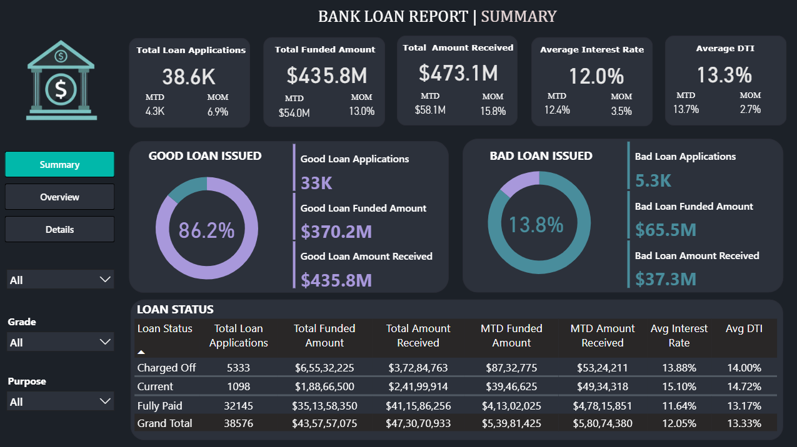
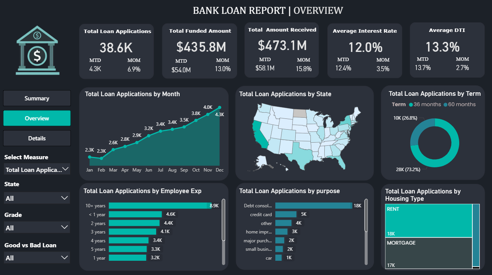
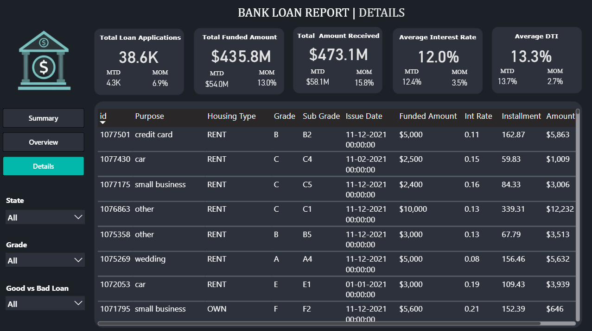

# 🏦 Bank Loan Performance | Analytics Dashboard

**[Live Dashboard Link Placeholder]**
[Link to the interactive Power BI/Tableau/Data Studio dashboard here]

---

## Short Description / Purpose
This **Bank Loan Performance Dashboard** is a comprehensive, multi-page data visualization tool designed to provide a high-level overview, detailed metrics, and granular transaction data for loan applications and performance. It enables analysts, risk managers, and loan officers to monitor key performance indicators (**KPIs**), track month-over-month (**MOM**) growth, assess loan status (**Good vs. Bad**), and analyze trends across various dimensions like state, term, purpose, and housing type.

---

## Tech Stack
The dashboard was built using the following tools and technologies:
* 📊 **Power BI Desktop** (Inferred) – Main data visualization platform used for report creation.
* 📂 **Power Query** (Inferred) – Data transformation and cleaning layer for preparing the raw loan data.
* 🧠 **DAX** (Data Analysis Expressions) (Inferred) – Used for calculated measures and dynamic visuals.
* 📝 **Data Modeling** (Inferred) – Relationships established among tables to enable cross-filtering.
* 📁 **File Format** – `.pbix` for development and image files for previews.

---

## Data Source
The data is derived from an internal **Bank Loan Database**, comprising anonymized records of loan applications, funded amounts, received payments, and loan status.

**Key Data Fields:**
* **Metrics:** Total Loan Applications, Total Funded Amount, Total Amount Received, Average Interest Rate, Average DTI (Debt-to-Income).
* **Dimensions:** Loan Term, Employee Experience, Loan Purpose, Housing Type, State, Grade, and Sub-Grade.
* **Performance:** Loan Status (Charged Off, Current, Fully Paid), Good Loan vs. Bad Loan metrics.

---

## Features / Highlights

### Business Problem
A financial institution needs an efficient way to monitor the massive volume of incoming loan applications and track the quality of its loan portfolio. Key challenges include quickly identifying growth drivers, spotting regional or purpose-based performance variations, and accurately quantifying the financial impact of 'Bad Loans' (severely delinquent or charged off).

### Goal of the Dashboard
To deliver an interactive visual tool that:
1.  **Monitor Loan Volume and Financials:** Track key metrics like applications, funded/received amounts, and average rates over time.
2.  **Assess Portfolio Health:** Clearly segment and quantify the good and bad loans issued.
3.  **Analyze Demographic/Loan Trends:** Understand which states, terms, purposes, and employee experience levels are driving application volume and loan performance.

### Walkthrough of Key Visuals
| Visual Type | Description | Page |
| :--- | :--- | :--- |
| **Key KPIs** | **Total Loan Applications ($\text{38.6K}$), Total Funded Amount ($\text{\$435.8M}$), Total Amount Received ($\text{\$473.1M}$)**, including Month-to-Date (MTD) and Month-over-Month (MOM) change metrics. | Summary & Overview |
| **Good vs. Bad Loans** | **Donut Charts** clearly distinguishing between $\text{86.2\%}$ Good Loans ($\text{33K}$ applications) and **$\text{13.8\%}$ Bad Loans** ($\text{5.3K}$ applications), highlighting the $\text{\$65.5M}$ funded amount associated with losses. | Summary |
| **Loan Status Table** | **Detailed table** segmenting the portfolio by **Charged Off** ($\text{5,333}$ loans), **Current**, and **Fully Paid**, with their respective financials and average rates. | Summary |
| **Applications by Purpose** | **Bar Chart** revealing that **Debt Consolidation** is the overwhelming primary purpose for loans ($\text{18K}$). | Overview |
| **Applications by Term** | **Donut Chart** showing the **$\text{60}$ months** term dominates, accounting for $\text{73.2\%}$ of all applications. | Overview |

### Business Impact & Insights
* **Risk Management:** The dashboard immediately identifies the substantial **$\text{13.8\%}$ Bad Loan rate**, totaling **$\text{\$65.5M}$ in funded bad loans**, prompting immediate review of underwriting and collections strategies.
* **Strategic Planning:** The dominance of the **$\text{60}$-month term** and **Debt Consolidation** purpose provides clear direction for future product development.
* **Underwriting Review:** Specific metrics for **Charged Off** loans (e.g., Avg DTI $\text{14.00\%}$) provide concrete benchmarks for tightening lending criteria.

---

## Screenshots / Demos

### 1. Summary Page (Portfolio Health)

### 2. Overview Page (Trend Analysis)

### 3. Details Page (Transaction View)

